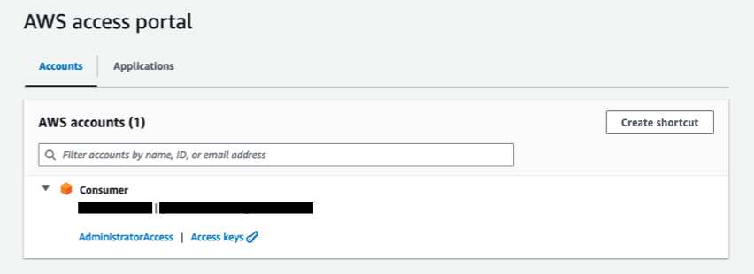
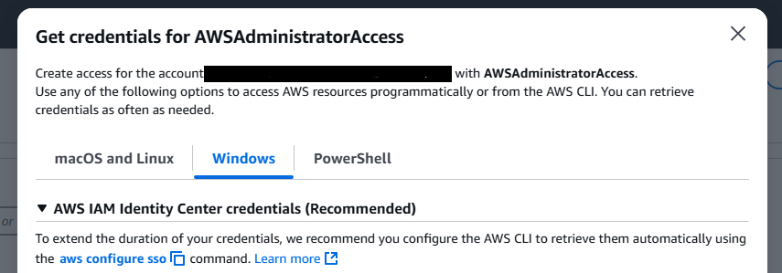
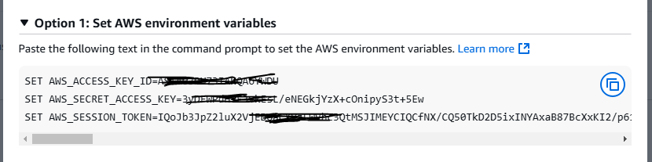
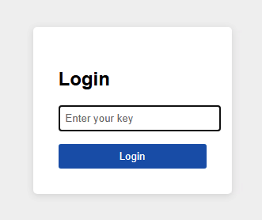
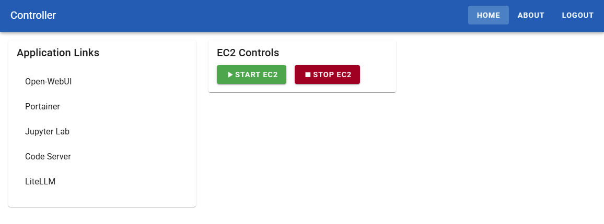
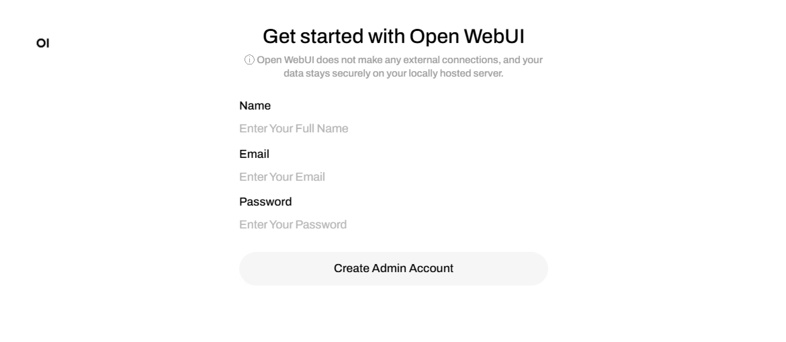
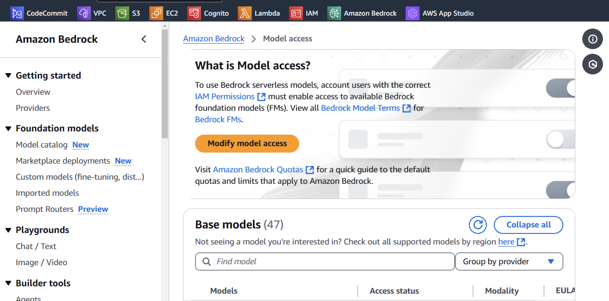
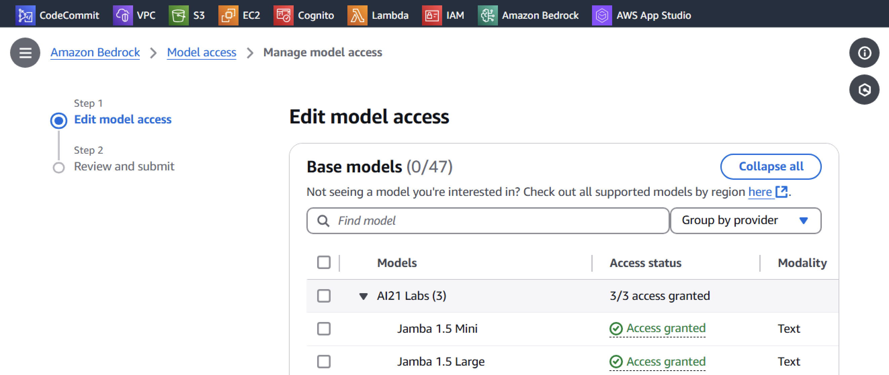
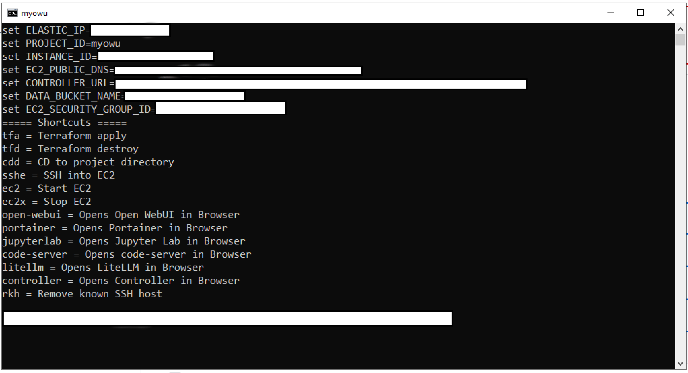

# my-open-webui: GenAI Workbench
Personal AI Exploration Platform on AWS Deploy a privacy-focused GenAI environment for individual use and rapid experimentation. Includes Open WebUI and essential tools like Portainer, VSCode, LiteLLM, and Jupyter Lab. Perfect for AI enthusiasts seeking a quick, secure personal sandbox.

## Assumptions and pre-requisites
- You are using Windows machine
- You have access to an AWS account
- You are using us-east-1 region

## Design principles
- Keep cost lowest
- KISS - Keep it simple, stupid 
- Scalability and performance are not primary focus. Primary focus is to get things done quickly.
- Security is tight. But only as much required. (Ex: using dummy certs to enable HTTPS)

## What will be installed?
- An EC2 will be created and following softwares will be installed in it:
    - Open WebUI
    - Portainer (Web based Docker management)
    - Code-server (VSCode on EC2 in your browser)
    - LiteLLM (Gateway to Bedrock)
    - Jupyter Lab
    - Caddy (reverse proxy and authetication server)
    - Controller (Custom web based tool to launch other apps and control EC2)

## Why should I use this?
- Enjoy full privacy. All your chats private. Bedrock does not store your chats and does not use it for retraining.
- Best use of your AWS account to learn and experiment GenAI.
- Get a powerful workbench on which you can build further capabilities.

## SETUP GUIDE
### Install Terraform
- Download from (Use AMD64):  
https://developer.hashicorp.com/terraform/install
- Unzip files to a folder
- Add the folder that contains terraform.exe file to the PATH

### Install Git for Windows
- Download and install from:  
https://git-scm.com/downloads/win

### Install AWS CLI for Windows. Follow:
https://docs.aws.amazon.com/cli/latest/userguide/getting-started-install.html

### Clone this project
- Open cmd window and execute:
```bat
git clone https://github.com/kashodiya/my-open-webui.git
cd my-open-webui
```

### Login to AWS
- Either set the AWS credentials env vars
- OR, setup profile and set AWS_DEFAULT_PROFILE
- Ensure env var AWS_REGION is set
- Note that your creadentials and config files are in .aws folder in your HOME folder.
    - If you do not have this folder or files, you should do ``aws configure``, or create them manually.
#### How to get credentials:
- If you are using AWS Access Portal, after login, you will see screen like (Click on your name):  

- Click on "Acces keys", then go to Windows tab:  



- Go to Options 1 and copy credentials by clicking the blue icon on the right: 



- Go back to the cmd window and paste it and hit Enter.
- Better way to login is to use AWS Profile. See guide here: https://docs.aws.amazon.com/cli/v1/userguide/cli-configure-files.html


### Create passwords for various apps
- Copy terraform\example-terraform.tfvars.json to terraform\terraform.tfvars.json
- Modify terraform\terraform.tfvars.json
- Replace "fill--me" by creating your own password, token, and keys - Min length must be 8
```json
{
    "code_server_password": "fill--me",
    "server_tool_password": "fill--me",
    "litellm_api_key": "fill--me",
    "jupyter_lab_token": "fill--me",
    "controller_auth_key": "fill--me",
    "bedrock_gateway_api_key": "fill--me"
}
```

### Init and apply terraform
```bat
cd terraform  
terraform init  
terraform apply  
```
- Check the plan and when ask for Enter a value, enter yes, hit Enter key
- This may take a few min when you run first time
- Note down controller_url from the output. 

### Open Controller
- Open browser
- Navigate to controller_url (the URL you noted from the previous step)
    - You can also get URL from terraform\set-tf-output-2-env-var.bat file.
- Use the key that you set in terraform.tfvars.json in controller_auth_key  


- "I DO NOT SEE APPLICATIONS LISTED" - wait for 5 min and then refresh. It takes few min for applications to get installed on EC2.
- Try accessing following applications:
  - open-webui  
  - portainer  
  - jupyter-lab  
  - code-server  
  - litellm  




### Set admin user password for Open WebUI
- Open open-webui from the Controller
- Since we are using self-signed certificates, bypass the warning by clicking Advance and then Continue. 
- Click on "Get started"


- Register yourself with name, email and password. You can use fake email.



### Request access to bedrock models
- Open docker\open-webui\litellm-config.yml and request model access for each models mentioned in the config.
- Login to AWS Console
- Request models access by going to:  
    - TIP: You only pay for what you use. You can request access to all the models. Click checkbox at the top on the model selection page. 
https://us-east-1.console.aws.amazon.com/bedrock/home?region=us-east-1#/modelaccess



- Click Modify model access button



- Select all models, click Next, and follow remaining steps

### Test model access from Open WebUI
- Open open-webui from the Controller
- Ensure that you can see approved models at top left
- Select a model 
- Type a question and hit Enter. Ensure that you get the answer.


### CONGRATULATIONS! At this point the setup is done. Follow remaining instructions if you want to do more with your EC2.

### Optional: If you like command line, create the Launcher
- Open cmd window, if not already open.
- Make sure you do one of the following:
    - Set AWS_DEFAULT_PROFILE
    - Set AWS_ACCESS_KEY_ID, AWS_SECRET_ACCESS_KEY and AWS_SESSION_TOKEN environment variable. 
- Cd to the project folder (cd my-open-webui)
- Run following command
```bat
scripts\create-launcher.bat
```
- "launcher.bat" file is created in local folder.
- Windows Explorer is opened.
- Double click "launcher.bat" file.
- NOTE: If you use AWS_DEFAULT_PROFILE you have create launcher only once. If you use AWS_ACCESS_KEY_ID etc. env vars, you have to create launcher everytime you login.  




### Track the setup of software in EC2 (easy way)
- Just use Launcher chortcut (Show EC2 setup logs): ``esl``

### Track the setup of software in EC2 (hard way)
- SSH into the EC2 (using 'sshe' shortcut command from the Launcher), and execute:
```bash
tail_setup_log
```
- This should be the last line in the log:
All installations completed.
- Press Ctrl+C to exit.
- To see complete user data script log using less command:  
```bash
less_setup_log
```
- Press q to exit

### SSH into EC2 (easy way)
- Run scripts\start-dev.bat
- Use this shortcut from the Launcher (read - ssh to ec2): sshe  

### SSH into EC2 (hard way)
- Find Elastic IP address from terraform\set-tf-output-2-env-var.bat file.
- SSH into the EC2 using shortcut from launcher OR,
- SSH into the EC2 server using this command:
```bat
set PROJECT_DIR=path/to/your/project/folder  
set ELASTIC_IP=your.elastic.ip.address  
ssh -i %PROJECT_DIR%\keys\private_key.pem ec2-user@%ELASTIC_IP%
```

### Find auto-generated passwords and tokens
- SSH into the EC2 (using 'sshe' shortcut command from the Launcher), and execute:
```bash
show_passwords
```
- Note down passwords and token to be used with Jupyter Lab and Code-server

### Use code server (VSCode to EC2 server in your Browser!)
- To open code-server, use shortcut command: code-server
- Use Controller to open code-server

### Use Jupyter Lab
- To open Jupyter Lab, use shortcut command: jupyterlab
- Use Controller to open Jupyter Lab

### Use Portainer (if you want to work with Docker using UI)
- To open Portainer, use shortcut command: portainer
- Use Controller to open Portainer
- If you see a timed out screen:
    - SSH into the server and execute: docker restart portainer
    - Refresh the web page


## Maintenance and operations

### Stop EC2 server
- Direct command
    - aws ec2 stop-instances --instance-ids %INSTANCE_ID%
- From Launcher
    - ec2x
- From Controller
    - Click button Stop EC2


### Start EC2 server
- Direct command
    - aws ec2 start-instances --instance-ids %INSTANCE_ID%
- From Launcher
    - ec2
- From Controller
    - Click button Start EC2

### Delete everything on AWS that was created via this project
- WARNING: This will delete everything that was created!
 ```bat
cd terraform  
terraform destroy  
```

### How to upgrade Open WebUI to new version?
- SSH into EC2
- Delete Docker containers using command:  
```bash
cd open-webui  
docker-compose down
```
- Delete Open WebUI image
```bash
docker rmi ghcr.io/open-webui/open-webui:main
```
- Create docker containers
```bash
docker-compose up -d
```
- Latest image will be automatically downloaded and used


### How to add more Bedrock models using LiteLLM (easy way)?
- Make sure that you have requested access to the model
- Edit docker\open-webui\litellm-config.yml
    - Add a model in the model list
- From the Launcher use shortcut ``ulc``

### How to add more Bedrock models using LiteLLM (hard way)?
- Make sure that you have requested access to the model
- SSH into EC2 server
- Edit docker\open-webui\litellm-config.yml
    - Add a model in the model list
- Restart LiteLLM container  
```bash
cd docker  
docker-compose restart litellm  
```

## How to activate other applications?
- To activate an application:
- Edit caddy\apps\<app-caddy-file>
    - Remove ``(not activated)`` text from first line. Just keep the app name.
```bat
cd caddy\apps
update <caddy-file-from-apps-folder>
cd ..\..
cd docker
do <app-folder> up
```
- Open Controller and open the app
- If you want to run any application that is in the form of a docker container, just study one of the app and follow the pattern.


### How to manage Open WebUI users?
TODO

### I messed up my environment, how I can do clean start again?
- If you have already run terraform apply, first destroy it:
```bat
cd terraform
terraform destroy
```
- Rename the my-open-webui folder to OLD-1-my-open-webui
- Go to the setup step for git clone and follow again

### How to check server (running in Docker) logs?
- SSH into EC2 server  
```bash
cd docker
docker logs -f open-webui
docker logs -f litellm
```
### Jupyter Lab service related commands:
```bash
sudo systemctl status jupyter-lab.service
sudo systemctl stop jupyter-lab.service
sudo systemctl start jupyter-lab.service
sudo systemctl restart jupyter-lab.service
sudo systemctl enable jupyter-lab.service
sudo journalctl -u jupyter-lab.service
sudo journalctl -fu jupyter-lab.service
```

### Caddy service related commands:
```bash
sudo systemctl status caddy
sudo systemctl daemon-reload
sudo systemctl enable caddy
sudo systemctl start caddy
sudo systemctl reload caddy
caddy validate --config /etc/caddy/Caddyfile
cat /etc/caddy/Caddyfile
```

### How to recreate EC2?
- WARNING: This will delete your EC2 and all data inside it!
- Execute following commands  
```bat
cd terraform  
terraform taint aws_instance.main_instance  
```
- After you create new EC2, before doing SSH into EC2, do this:
```bat
ssh-keygen -R %ELASTIC_IP%  
```


### How to change code-server password
- Open code-server (using Launcher shortcut)
- Edit: /home/ec2-user/.config/code-server/config.yaml 
- Set new password
- SSH into EC2 and restart code-server
```bash
sudo systemctl restart code-server@$USER
```

### Commands related to the code-server
```bash
sudo systemctl status code-server@$USER
sudo systemctl stop code-server@$USER
sudo cat /usr/lib/systemd/system/code-server@.service
sudo vi /usr/lib/systemd/system/code-server@.service
sudo systemctl daemon-reload
sudo systemctl restart code-server@$USER
```

- Read password
cat /home/ec2-user/.config/code-server/config.yaml


## Tips and tricks

### Careful before changing project_id
- If you have already deployed this product and change project_id and deploy again, it will destroy previous deployment. 

### Stop EC2 when not used without worry
- When you start the EC2 (use shortcut "ec2") all your apps are started by default!

### How to find out unused cidr for new subnet
- Run this command in cmd. Make sure you replace VPC ID in the command with your VPC ID.
```bat
cd scripts
powershell.exe -ExecutionPolicy Bypass -File find-next-available-cidr.ps1 "vpc-your-vpc-id-here"
```

### Tip for setting your development environment
- Prefer to use AWS profile instead of directly using AWS credentials in enviroment variables
- Create a bat file on your desktop with this content:  
```bat
@echo off  
set AWS_DEFAULT_PROFILE=your-aws-profile  
start cmd /k "cd /d D:\Users\full-path-to-project-code && call scripts\start-dev.bat"  
```
- Whenever you want to start working on this project, just double click this bat file!  
- Read the info presented in the cmd window!  
- It offers following shortcuts:  
```ini
tfa = Terraform apply  
sshe = SSH into EC2  
ec2 = Start EC2  
ec2x = Stop EC2  
open-webui = Opens Open WebUI in Browser  
portainer = Opens Portainer in Browser  
code-server = Opens code-server in Browser  
litellm = Opens LiteLLM in Browser  
rkh = Remove known SSH host  
```

### How to allow my team members to use my Open WebUI server?
- Login to Open WebUI
- Click on top right avatar icon
- Settings -> Admin Settings -> General
- Turn on - Enable New Sign Ups
- Ensure that Default User Role is 'pending'
- If your team member is on other network, find out its public facing address, add it to the allowed_source_ips JSON array in terraform\terraform.tfvars.json file
- Do terraform apply
- Give them the URL of the Open WebUI
- Ask them to self sign
- Once they self sign, enable their access by:
    - Click on top right avatar icon
    - Click Admin Panel
    - Click PENDING once to make it USER
- Ask your user to login or refresh their page


### How to upgrade Open WebUI to new version
- SSH into EC2, and run:
```bash
cd docker/open-webui
docker-compose down
docker-compose down --rmi all
docker-compose up -d
```

## Resources and references
### Open WebUI
- [Docs](https://docs.openwebui.com/)
- [Home page](https://openwebui.com/)

### LiteLLM
- [Docs](https://docs.litellm.ai/docs/)
- [Home page](https://www.litellm.ai/)

### Code server
- [GitHub page](https://github.com/coder/code-server)

### Portainer
- [GitHub page](https://github.com/portainer/portainer)
- [Home page](https://www.portainer.io/)

### Caddy
- [Home page](https://caddyserver.com/docs/quick-starts/reverse-proxy)

## Troubleshooting

### I messed up the install. How can I restart?
- If you have done terraform apply...
    - In cmd window cd to terraform folder and do "terraform destroy"
    - Git clone in new folder, and follow instructions
- If yoh have not done terraform apply...
    - Git clone in new folder, and follow instructions
- See section: How to recreate EC2?

### When doing terraform apply: Error: No matching Internet Gateway found
- You should create Internet gatewat and attach to your VPC (see the instructions above)

### Using my browser, when I go to Portainer, I get the following error New Portainer installation Your Portainer instance timed out for security purposes. To re-enable your Portainer instance, you will need to restart Portainer.
- To resolve this, SSH into EC2 server
- Run this command
```bash
docker restart portainer
```
- Refresh browser
- Set password (min length 12 characters)


### When I ssh in EC2 I get error: The authenticity of host can't be established.
- From launcher run: rkh
- Then run: sshe


## Internal design/architecture

### Is this a good architecture?
- Yes and No!
- Do not use any design pattern used here in production systems.
- This is good desgn for quick and dirty setup for learning and experimentation.

### To avoid cost...
- We are not using Route53, API Gateay and ALBs
- All the work is done on single EC2
- Shortcuts are provided to start and stop EC2 easily

### How Caddy server is used?
- All the port numbers starting from 7100 are used by Caddy to serve apps running on ports from 8100 respectively. 
- Caddy config is stored at /etc/caddy/Caddyfile
- It uses a dummy cert to serve HTTPS
- Caddy can manage users and password and offer authentication. This is useful for appss that do not have native/local user management, like demo apps you may create etc.

### How server prodcuts are instaled on EC2?
- Server is setup using user-data script when creating EC2
- User data script is dynamically generated in terraform main.tf
- Files from docker etc folder are read by terraform and injected into user-data script along with ec2-setup/user-data.sh file. 
- See user-data.sh file to find how things are installed.
- Most of the products are run as Docker containers

### How Open WebUI is configured?
- For details look at these files:
    - docker\open-webui\docker-compose.yml
    - docker\open-webui\litellm-config.yml
- Open WebUI talks to LiteLLM and LiteLLM talks to Bedrock based on litellm-config.yml
- Open WebUI is using sqlite3 as the database
    - Location of sqlite3 db file: 


### How launcher works?
- Launcher is a bat file that you create on dektop so that you can work with this project.
- Launcher knows about the EC2, its IP address, etc.
- Launcher also offers you several shortcuts
- How do Launcher knows about this project?
    - When you do terraform apply, the script generates a bat file terraform\set-tf-output-2-env-var.bat
    - This bat file has information like Elastic IP, EC2 ID etc. 
    - The launcher read this file so it can use those information.
    - Shortcuts offered by Launcher is printed to the console when you launch it, so you not need to remember it!


## If you want to taint controller lambda, you have to taint url also
```bat
terraform taint aws_lambda_function.main_controller_lambda 
terraform taint aws_lambda_function_url.controller_lambda_url
```


### How to update and deploy Controller Lambda
- To deploy lambda (after you modify):
```bat
cd lambda
deploy controller
```
- If you add a package, ensure that you update erquirements.txt and run this form controller folder:
```bat
pip install -r requirements.txt -t package
```

### How to update Controller Lambda key?
- Open launcher, and run this commands:
```bat
set CONTROLLER_AUTH_KEY=<new-key>
cd lambda
deploy.bat controller
```


## Q&A
1. Q: What is OpenWebUI?  
   A: OpenWebUI is an open-source web interface for interacting with large language models (LLMs). It provides a user-friendly way to communicate with various AI models and can be customized to suit different needs.
 
2. Q: How does LiteLLM work?  
   A: LiteLLM is a lightweight library that provides a unified interface for different LLM providers. It simplifies the process of integrating and switching between various AI models, making it easier to work with multiple LLMs in your applications.
 
3. Q: What are the benefits of using Portainer?  
   A: Portainer is a lightweight management UI for Docker environments. It simplifies container management, allows for easy deployment and monitoring of applications, and provides a user-friendly interface for managing Docker resources without needing extensive command-line knowledge.
 
4. Q: Is Caddy difficult to set up?  
   A: No, Caddy is designed to be simple to set up and use. It's a web server that automatically handles HTTPS configuration, making it easier to secure your web applications. Its configuration file is human-readable and straightforward.
 
5. Q: Can I use Code-Server to develop remotely?  
   A: Yes, Code-Server allows you to run VS Code on a remote server and access it through a web browser. This enables remote development from any device with a web browser, making it ideal for cloud-based development environments.
 
6. Q: How does OpenWebUI integrate with different LLM providers?  
   A: OpenWebUI can integrate with various LLM providers through APIs. It often uses libraries like LiteLLM to facilitate these connections, allowing users to interact with different AI models through a single interface.
 
7. Q: What are the main features of Portainer?  
   A: Portainer features include container management, image management, network configuration, volume management, and user access control. It also provides a dashboard for monitoring container health and resource usage.
 
8. Q: Can Caddy handle load balancing?  
   A: Yes, Caddy can handle load balancing. It includes built-in features for distributing traffic across multiple backend servers, making it useful for improving the performance and reliability of web applications.
 
9. Q: Is Code-Server secure to use?  
   A: Code-Server can be secured by implementing proper authentication, using HTTPS, and following best practices for server security. It's important to configure it correctly to ensure the security of your development environment.
 
10. Q: Can LiteLLM work with custom or fine-tuned models?  
    A: Yes, LiteLLM can work with custom or fine-tuned models. It supports a wide range of models and providers, and you can often integrate custom models by following the library's documentation for adding new model support.
 
11. Q: How does Portainer handle Docker Swarm or Kubernetes environments?  
    A: Portainer provides support for both Docker Swarm and Kubernetes environments. It offers features for managing clusters, deploying stacks, and monitoring distributed systems, making it valuable for more complex container orchestration scenarios.
 
12. Q: Can OpenWebUI be customized for specific use cases?  
    A: Yes, OpenWebUI is designed to be customizable. Users can often modify the interface, add new features, or integrate it with other tools to suit their specific requirements or organizational needs.


## Monthly reset by admins
- Some organizaions delete all the resources at the end of the month in their R&D env.
- If that happens follow these steps:
    - Delete Routing table (which has name of your project_id)
    - Delete VPC

## TODO:

Create shortcuts to enable disable ec2 schedular

Restart Portainer btn

set-dev.bat
    - shortcut help - show again
